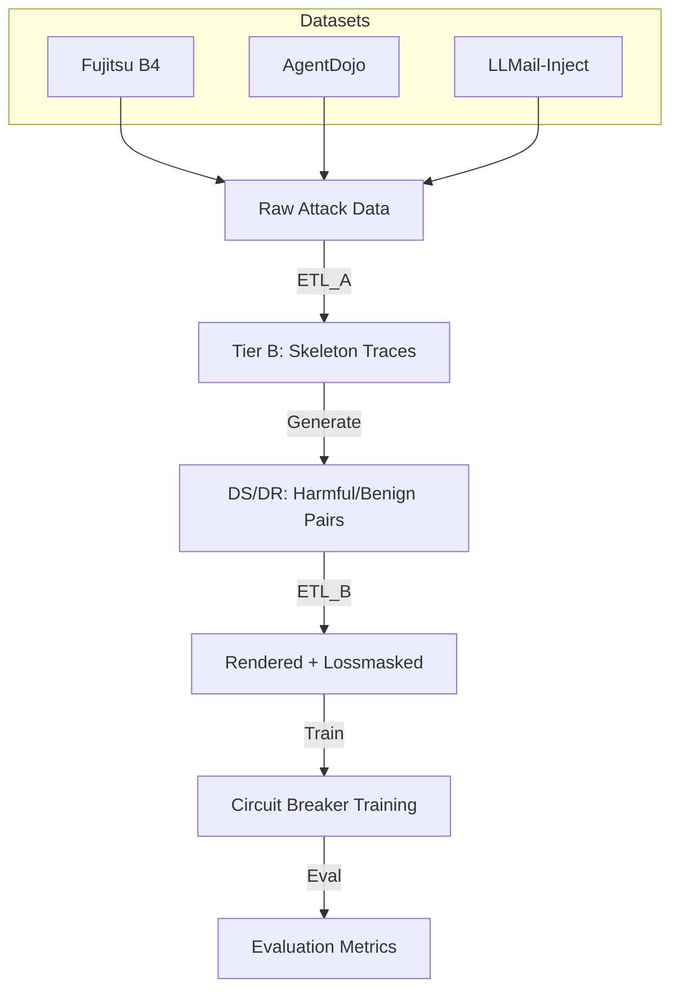

# RRFA: Representation Rerouting for Agentic Safety

**Internal Defenses Against Prompt Injection using Circuit Breakers**

RRFA applies circuit breaker training to make LLM agents safe against prompt injection attacks. The core idea is to train LoRA adapters that make harmful internal representations orthogonal to benign ones, so the model refuses to execute injected tool calls while preserving normal capability.

## Project Architecture



## Quick Start

### 1. Installation
Ensure you have the required dependencies installed:
```bash
pip install -r requirements.txt
```

### 2. Running a Sweep
The primary entry point for running hyperparameter sweeps is `slurm/pipeline/sweep_hparams_simple.sbatch`. This script handles data generation and sweep orchestration.

```bash
sbatch slurm/pipeline/sweep_hparams_simple.sbatch
```

### 3. Analyzing Results
Once the sweep is complete, use the analysis scripts to visualize results and generate plots.

```bash
# General analysis and summary table
python scripts/visualize_sweep_results.py /path/to/sweep_dir

# Generate trade-off plots (Pareto frontier)
python scripts/plot_tradeoff.py --sweep-dir /path/to/sweep_dir
```

## Configuration Reference

The sweep scripts use the following environment variables for configuration:

| Variable | Description | Default |
|----------|-------------|---------|
| `MODEL_ID` | Base model identifier | `meta-llama/Llama-3.1-8B-Instruct` |
| `PRESET` | Training preset configuration | `llama-3.1-8b-instruct` |
| `GRAD_ACCUM` | Gradient accumulation steps | `4` |
| `TOTAL_STEPS` | Training steps per config | `200` |
| `ALPHAS` | Comma-separated alpha values | `5.0,10.0,15.0` |
| `BATCH_SIZE` | Batch size per device | `1` (optimized for 80GB H100) |

## Datasets

*   **Fujitsu B4**: Tool-flip attacks where injection tricks the model into calling the wrong tool.
*   **AgentDojo**: A diverse collection of tool-flip and goal-hijacking attacks.
*   **LLMail-Inject**: Email agent injection attacks. Success is defined by the model calling `send_email`. Correct behavior is refusal (no tool call).

## Directory Structure

*   `docs/`: Documentation for the pipeline and datasets.
*   `paper/`: LaTeX source for the research paper.
*   `scripts/`: Analysis and visualization scripts.
*   `slurm/`: SLURM submission scripts for training and sweeps.
*   `src/`: Source code for training, evaluation, and data processing.
    *   `src/evaluation/`: Evaluation logic (`eval.py`).
    *   `src/training/`: Training logic (`trainer.py`, `losses.py`).
    *   `src/schemas/`: Data schemas and ETL tools.

## Key Scripts

*   `scripts/visualize_sweep_results.py`: Main analysis script. Reads sweep output, generates summary tables, and shows detailed sample comparisons.
*   `scripts/plot_tradeoff.py`: Generates safety vs. capability scatter plots and identifies the Pareto frontier.
*   `src/training/trainer.py`: Implements `CircuitBreakerTrainer`, optimized for single-GPU VRAM usage.
*   `src/evaluation/eval.py`: Contains evaluation logic, including specific metrics for LLMail (attack success vs. usefulness).

## References

*   Zou, A., et al. (2024). Representation Engineering: A Top-Down Approach to AI Transparency. *arXiv preprint arXiv:2310.01405*.
